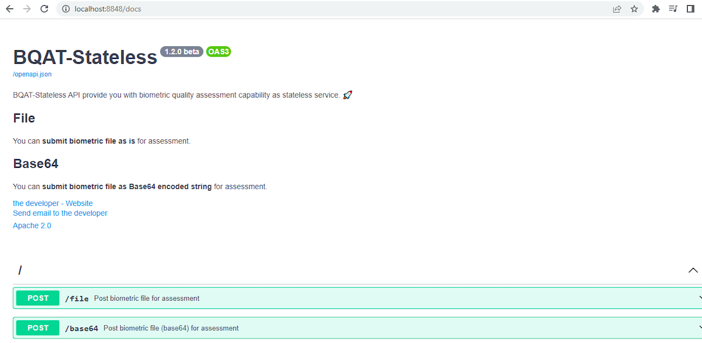

# BQAT SDK Wrapper

This service acts as a wrapper over BQAT's (Biometric Quality Assessment Tool) [stateless API](https://github.com/Biometix/bqat-stateless) to get the quality parameter along with other metrics for analysis of a given biometric modality like Fingerprint, Face, Iris for data formats type such as JP2000 and WSQ.

This wrapper follows [MOSIP Biometric SDK API Specification](https://docs.mosip.io/1.1.5/apis/biometric-sdk-api-specification).

## Set Up

In order to run this application you need to first setup or configure the beloww properties in the `application.properties` file.

```properties
bqat.server.ipaddress=(host)
bqat.server.port=:(port)
bqat.server.path=/base64?urlsafe=true
bqat.content.type=application/json
bqat.content.charset=utf-8
bqat.jsonkey.finger.quality.score=NFIQ2
bqat.jsonkey.iris.quality.score=quality
bqat.jsonkey.face.quality.score=quality
bqat.json.results=results
```

## Run as Docker

### Pull Docker Image

Pull the BAQT stateless API docker image from docker hub.

`docker pull ghcr.io/biometix/bqat-stateless:latest`

### Run Docker Image

Use the below commande to run the docker image.

`docker compose up -d`

### Check Service Status

Call the below endpoint from your browser to verify if the service is running.
`http://{host}:8848/docs/`

Example: For localhost call, `http://localhost:8848/docs`

You should see the below response, 




## BAQT Stateless API

### Sample Request 

Request URL: `http://localhost:8848/base64?urlsafe=true`

Request Body:
```JSON
{
  "modality": "iris",
  "id": "uniqueid",
  "type": "jp2",
  "data": "base64URLEncodedBiometricData",
  "requestTime": "2023-04-27T04:30:37.131147300",
  "version": "1.0.0"
}
```

### Sample Response Per Modality

#### Face

```JSON
{
	"results": {
		"file": "face_1682599598212.jp2",
		"background_deviation": "7.95134",
		"background_grayness": "52",
		"blur": "9.29379",
		"blur_face": "8.29874",
		"focus": "7848.72",
		"focus_face": "11311.2",
		"openbr_IPD": "64",
		"openbr_confidence": "1",
		"opencv_IPD": "60",
		"opencv_eye_count": "2",
		"opencv_face_found": "1",
		"opencv_face_height": "164",
		"opencv_face_width": "164",
		"opencv_frontal_face_found": "1",
		"opencv_landmarks_count": "4",
		"opencv_mouth_count": "1",
		"opencv_nose_count": "1",
		"opencv_profile_face_found": "0",
		"over_exposure": "0.0167188",
		"over_exposure_face": "0.0422739",
		"quality": "9.68888",
		"sap_code": "2",
		"skin_ratio_face": "0.822873",
		"skin_ratio_full": "0.434818",
		"image_area": "76800",
		"image_channels": "3",
		"image_height": "320",
		"image_ratio": "0.75",
		"image_width": "240",
		"openbr_left_eye_x": "151",
		"openbr_left_eye_y": "152",
		"openbr_right_eye_x": "87",
		"openbr_right_eye_y": "152",
		"opencv_face_center_of_mass_x": "119.742",
		"opencv_face_center_of_mass_y": "192.822",
		"opencv_face_offset_x": "0.00833333",
		"opencv_face_offset_y": "-0.2",
		"opencv_face_x": "39",
		"opencv_face_y": "110",
		"opencv_left_eye_x": "150",
		"opencv_left_eye_y": "153",
		"opencv_mouth_x": "116",
		"opencv_mouth_y": "234",
		"opencv_nose_x": "120",
		"opencv_nose_y": "193",
		"opencv_right_eye_x": "90",
		"opencv_right_eye_y": "153"
	},
	"engine": "BQAT-core 1.2.0 beta",
	"modality": "face",
	"id": "face_1682599598212",
	"timestamp": "2023-04-27 12:46:40.106507"
}
```

#### Fingerprint
```JSON
{
	"results": {
		"file": "fingerprint_Right IndexFinger_1682599605621.jp2",
		"Width": 275,
		"Height": 400,
		"NFIQ2": "84",
		"Quantized": "0",
		"Resampled": "0",
		"UniformImage": "94.17070",
		"EmptyImageOrContrastTooLow": "185.25873",
		"FingerprintImageWithMinutiae": "47",
		"SufficientFingerprintForeground": "79625",
		"EdgeStd": 1.2197387797210527,
		"converted": "jp2 -> png"
	},
	"engine": "BQAT-core 1.2.0 beta",
	"modality": "fingerprint",
	"id": "fingerprint_Right IndexFinger_1682599605621",
	"timestamp": "2023-04-27 12:46:45.689680"
}
```

#### Iris
```JSON
{
	"results": {
		"file": "iris_Left_1682599612619.jp2",
		"quality": "77",
		"contrast": "53",
		"iris_diameter": "264",
		"iris_pupil_gs": "23.6313",
		"iris_sclera_gs": "48",
		"normalized_contrast": "1",
		"normalized_iris_diameter": "1",
		"normalized_iris_pupil_gs": "0.936312",
		"normalized_iris_sclera_gs": "1",
		"normalized_percent_visible_iris": "1",
		"normalized_sharpness": "1",
		"percent_visible_iris": "91",
		"sharpness": "169",
		"image_height": "301",
		"image_width": "401",
		"iris_center_x": "200",
		"iris_center_y": "139"
	},
	"engine": "BQAT-core 1.2.0 beta",
	"modality": "iris",
	"id": "iris_Left_1682599612619",
	"timestamp": "2023-04-27 12:46:52.802822"
}
```

## Wrapper Implementaion Details

The wrapper works as per [MOSIP's specification](https://docs.mosip.io/1.1.5/apis/biometric-sdk-api-specification) for quality check. The wrapper received request for quality check for a single Biometric Image Record (BIR) and calls the BAQT stateless API to perform quality check and retruns the result as per the specification.
